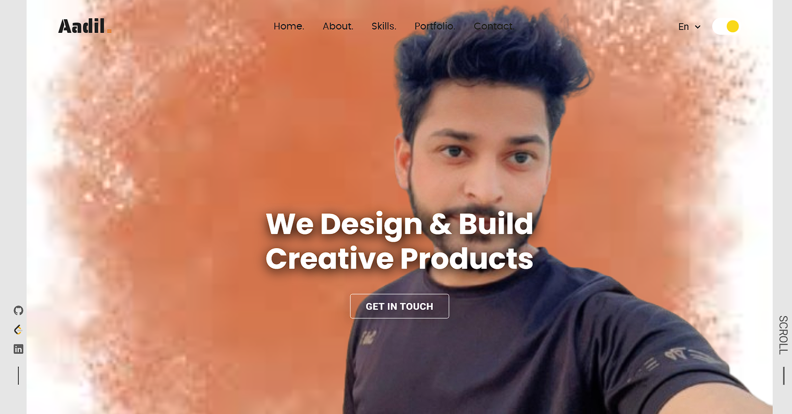

# My_Portfolio

<div align="center">
  

  <br />
  <br />
  
  

  <h2 align="center">Aadil - Personal portfolio</h2>

  This website is fully responsive personal portfolio, <br />Responsive for all devices, built using HTML, CSS, and JavaScript.

  <a href="https://mustafaaadil448.github.io/My_Portfolio/"><strong>➥ Live Demo</strong></a>

</div>

<br />


### Prerequisites

Before you begin, ensure you have met the following requirements:

* [Git](https://git-scm.com/downloads "Download Git") must be installed on your operating system.

### Run Locally

To run **Aadil-portfolio** locally, run this command on your git bash:

Linux and macOS:

```bash
sudo git clone https://github.com/mustafaaadil448/My_Portfolio.git
```

Windows:

```bash
git:  git clone 
```

### Contact

If you want to contact with me you can reach me at [LinkedIn](https://www.linkedin.com/in/md-mustafa-ansari-35b6a122b).

### License

This project is **free to use** and does not contains any license.

